# HMS Core 3D Modeling Kit Sample Code

English | [中文](https://github.com/HMS-Core/hms-3d-modeling-demo/blob/master/3DModeling-Sample/README_ZH.md)
## Contents

 * [Introduction](#Introduction)
 * [Project Directory](#Project-Directory)
 * [Application Scenarios](#Application-Scenarios)
 * [Procedure](#Procedure)
 * [Environment Requirements](#Environment-Requirements)
 * [License](#License)

## Introduction
The sample code introduces how to use the SDKs provided by 3D Modeling Kit to implement three capabilities:

### 3D Object Reconstruction
This part shows how to upload collected images, query the modeling progress, and download the model.

<table><tr>
<td>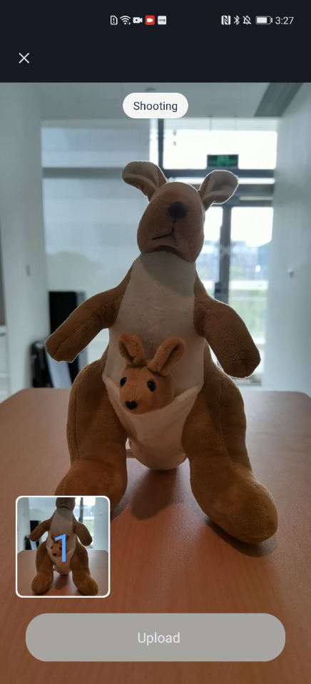</td>
<td>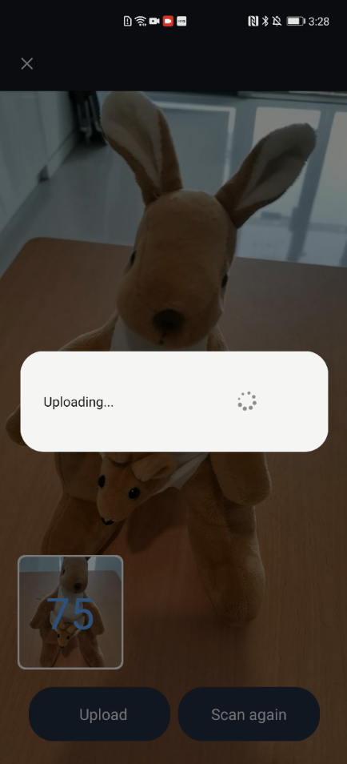</td>
<td>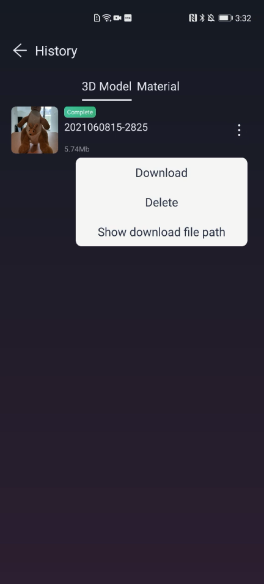</td>
</tr></table>

#### Shoe Modeling
**Suggestions**
Shooting Devices

- Light box: provides a simple and pure background that does not reflect light and ensures bright and even lighting, which brings a better modeling effect.
- Turntable: requires no human labor to turn around an object for image shooting.
- Gimbal: ensures stable distance between the phone and object, accurate focus, and clear images, which brings a better modeling effect.

**Shooting Steps**
Put the turntable in the light box in which the background is simple and does not reflect light, and the lighting is bright and even. Put the shoe on the turntable. As it turns five rounds at a fixed speed, take 108 images of the shoe in total.
1. Place the phone camera at an angle of zero degrees above the shoe's horizontal axis. Take 24 images as the turntable turns one round.

<td>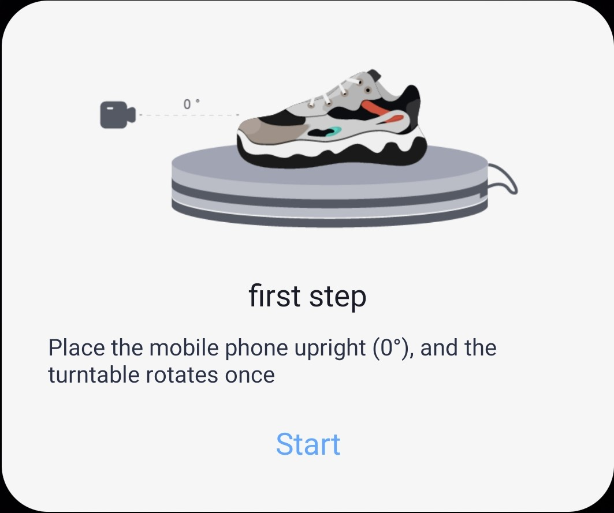</td>

2. Place the phone camera at an angle of 45 degrees above the shoe's horizontal axis. Take 24 images as the turntable turns one round.

<td>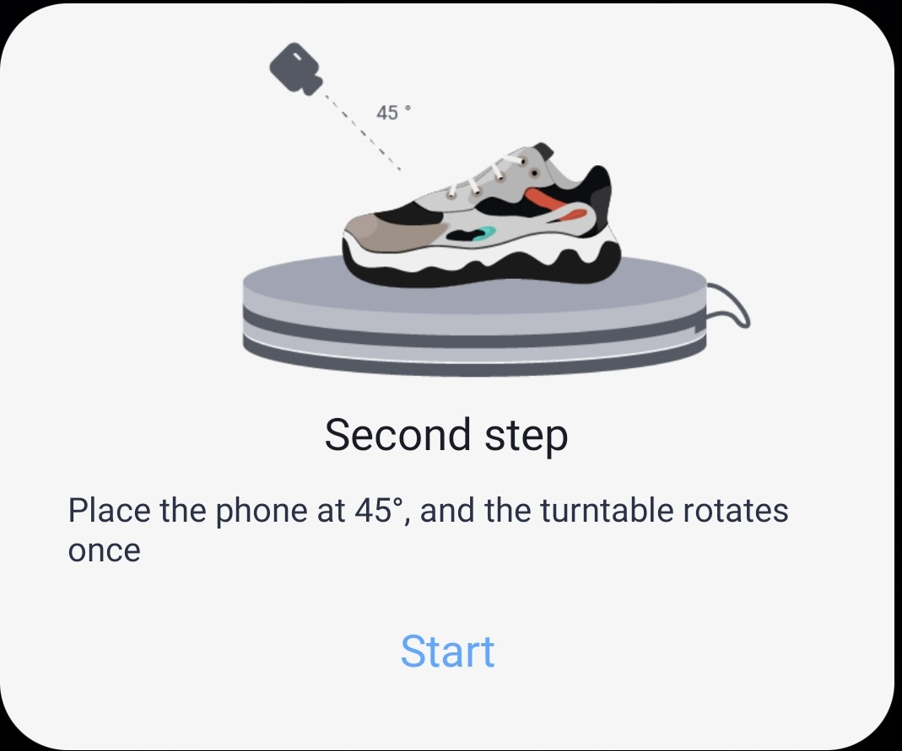</td>

3. Place the phone camera at an angle of 90 degrees above the shoe's horizontal axis and make sure that the camera faces the insole. Take 12 images as the turntable turns half a round.

<td>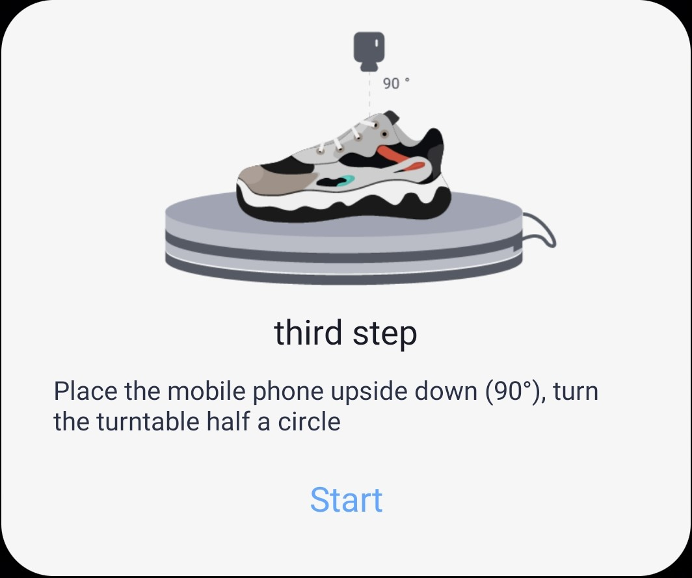</td>

4. Put the shoe on its side. Place the phone camera at an angle of zero to 15 degrees above the shoe's horizontal axis. Take 24 images as the turntable turns one round.

<td>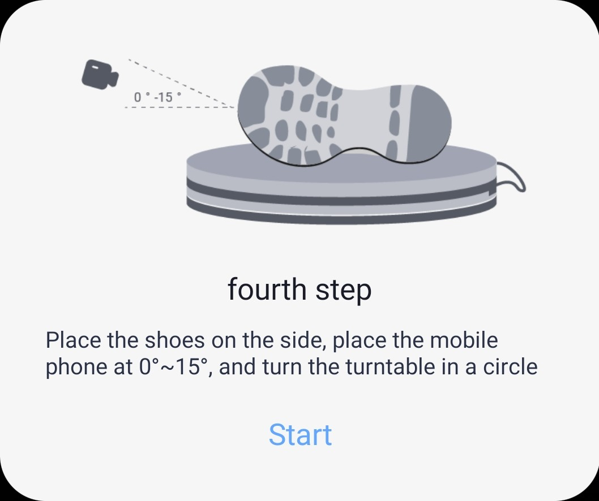</td>

5. Put the shoe on its side. Place the phone camera at an angle of 45 degrees above the shoe's horizontal axis. Take 24 images as the turntable turns one round. Ensure each image contains both the shoe upper and outsole.

<td>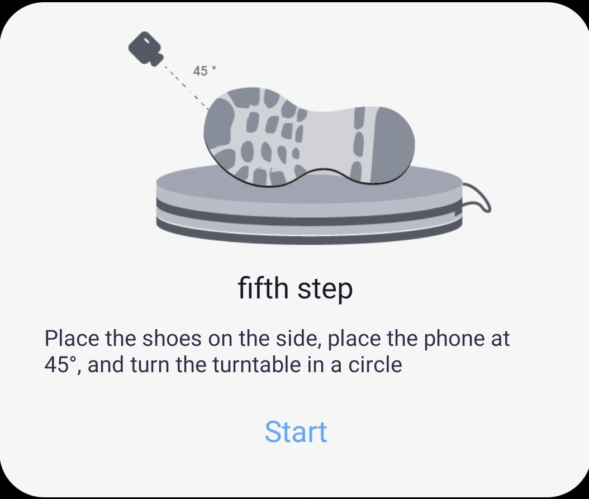</td>

### Material Generation
This part shows how to upload collected images, query the progress of texture map generation, and download the maps.

<table><tr>
<td>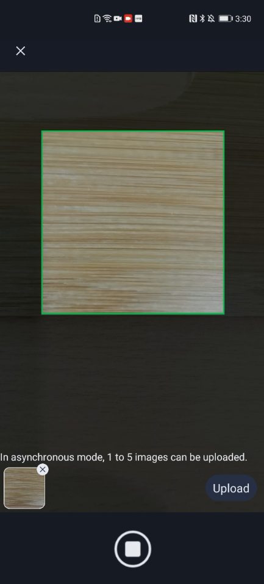</td>
<td>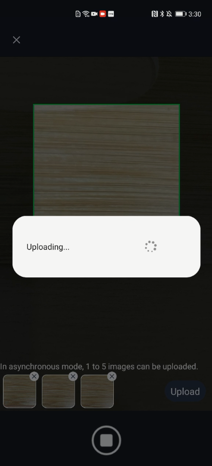</td>
<td>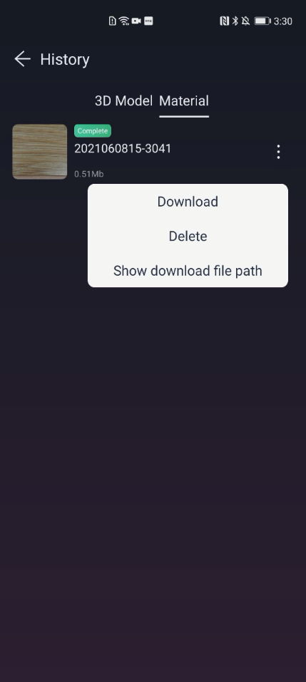</td>
</tr></table>

### Motion Capture

This part shows how to implement motion capture in real-time video streams, a video, and an image.

<table><tr>
<td>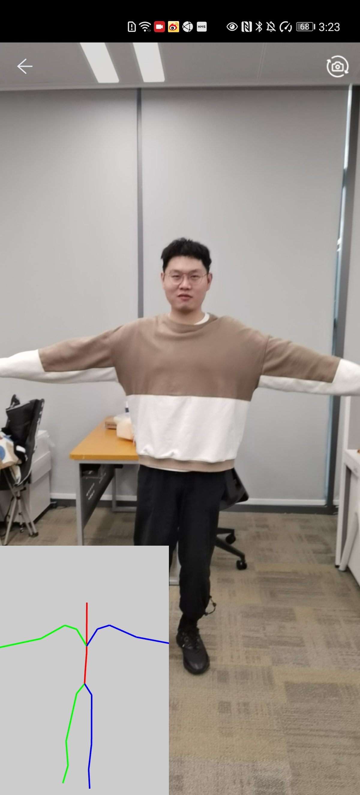</td>
<td>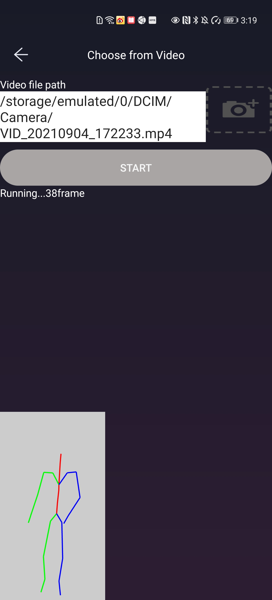</td>
<td>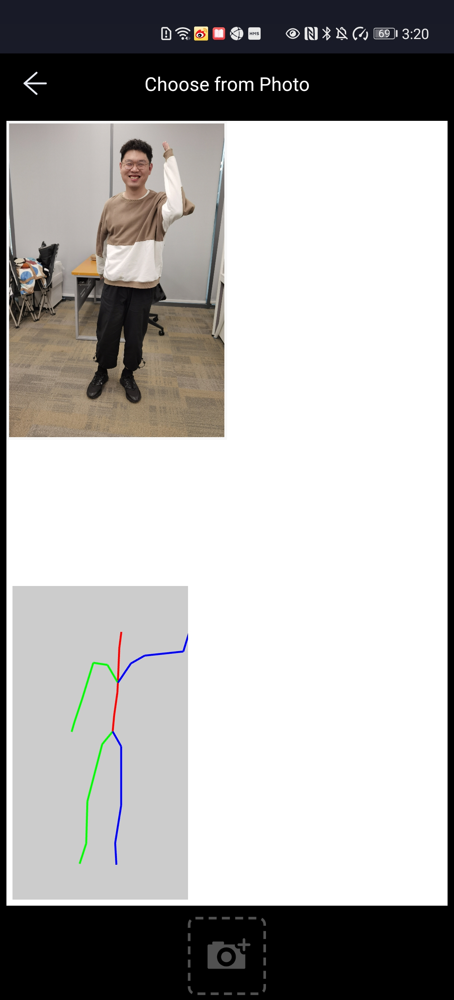</td>
</tr></table>

For more details, please refer to the [3D Modeling Kit development guide](https://developer.huawei.com/consumer/en/doc/development/graphics-Guides/introduction-0000001143077297).

## Project Directory
app

    |-- com.huawei.hms.modeling3d
        |-- ui
            |-- modelingui
            	|-- ScanActivity // Upload images for 3D object reconstruction.
            	|-- CaptureMaterialActivity // Upload images for material generation.
            	|-- HistoryModelDataFragment // Download the generated model.
            	|-- HistoryMaterialDataFragment // Download the generated texture maps.
        |-- utils
        	|-- skeleton
        		|-- LocalSkeletonProcessor // Motion capture engine.
    	|-- Modeling3dDemo

## Application Scenarios
3D Modeling Kit from HMS Core serves as a toolkit facilitating the development of apps with 3D content. To learn the scenarios where this kit can play a role, please refer to its [use cases](https://developer.huawei.com/consumer/en/doc/development/graphics-Guides/case-one-0000001148975606).

## Development
 - Clone the code library to the local project.

       git clone https://github.com/HMS-Core/hms-3d-modeling-demo.git

 - [Register as a Huawei developer and create an app in AppGallery Connect](https://developer.huawei.com/consumer/en/service/josp/agc/index.html), if you haven't done so.
 - Obtain the **agconnect-services.json** file in AppGallery Connect. For details, please refer to [Configuring App Information in AppGallery Connect](https://developer.huawei.com/consumer/en/doc/development/graphics-Guides/config-agc-0000001142925473).
 - Replace the **sample-agconnect-services.json** file with **agconnect-services.json**.
 - Compile the project and run it on an Android device or simulator.

Notes:

You can only use a custom package name to apply for the **agconnect-services.json** file.
To use the on-cloud services of 3D Modeling Kit, replace the **applicationId** in the app-level **build.gradle** file with the package name used to apply for the **agconnect-services.json** file.

## Environment Requirements
Android 5.0 or later.
Motion capture requires a 64-bit ARM-based Android phone.

##  License
The sample code is licensed under [Apache License 2.0](http://www.apache.org/licenses/LICENSE-2.0).
