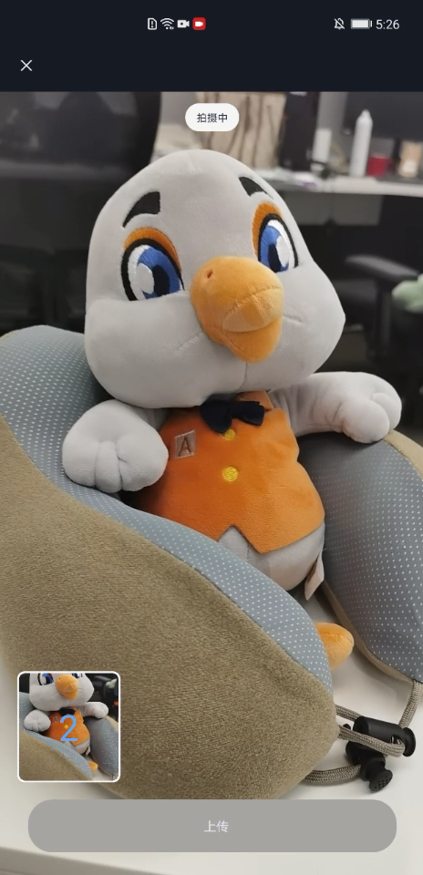
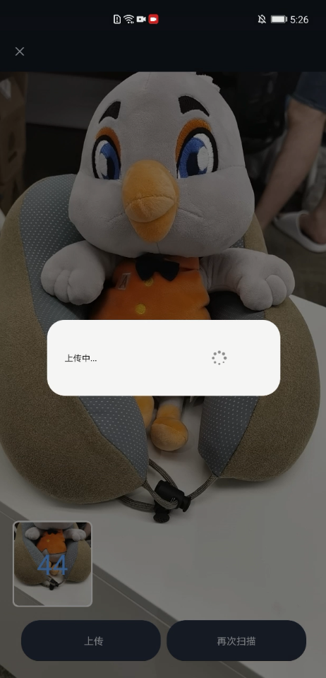
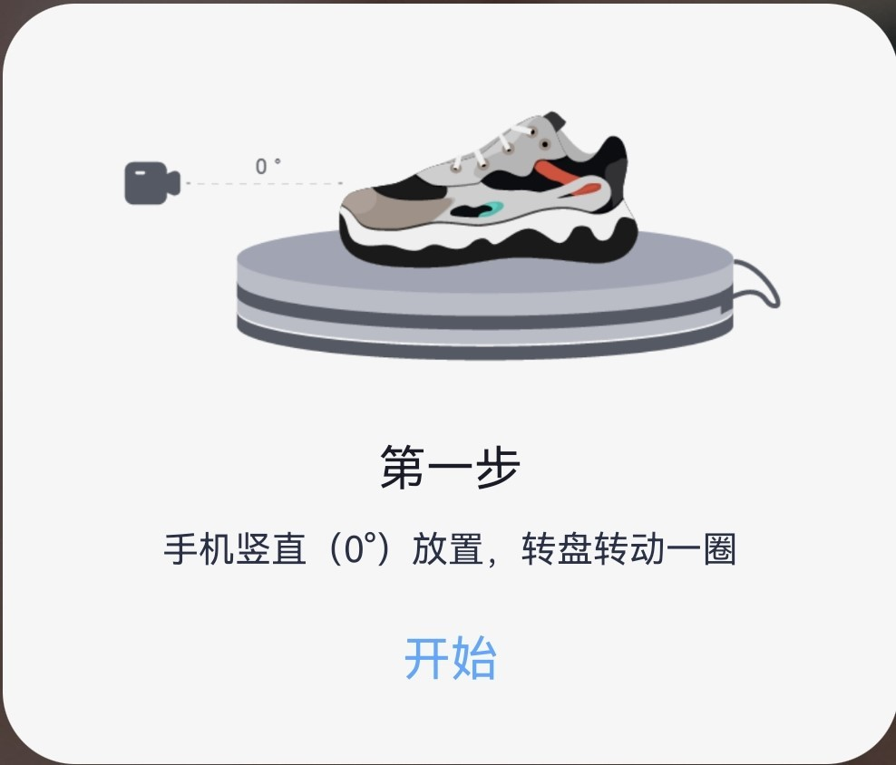
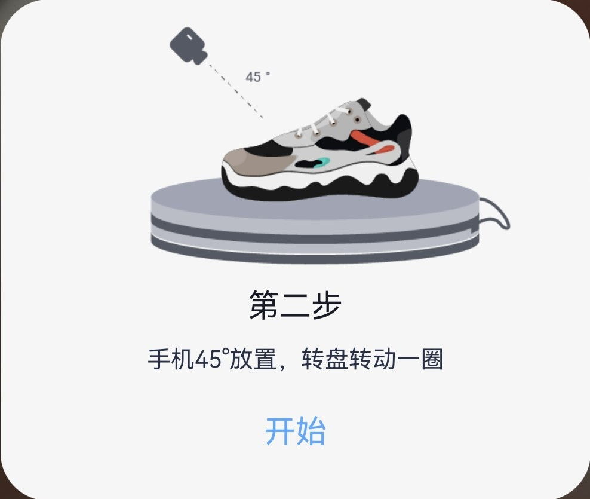
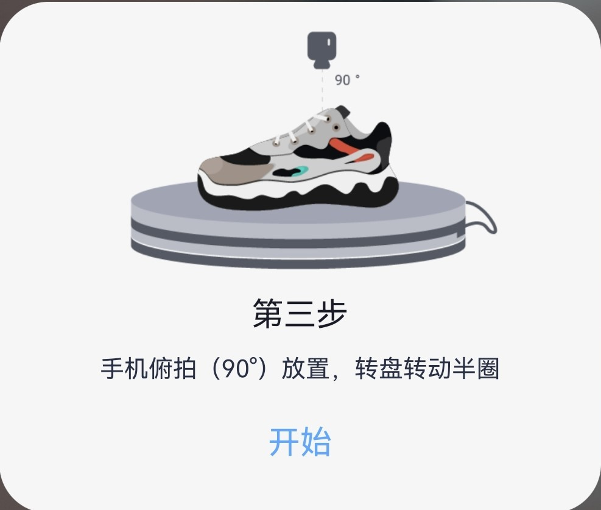
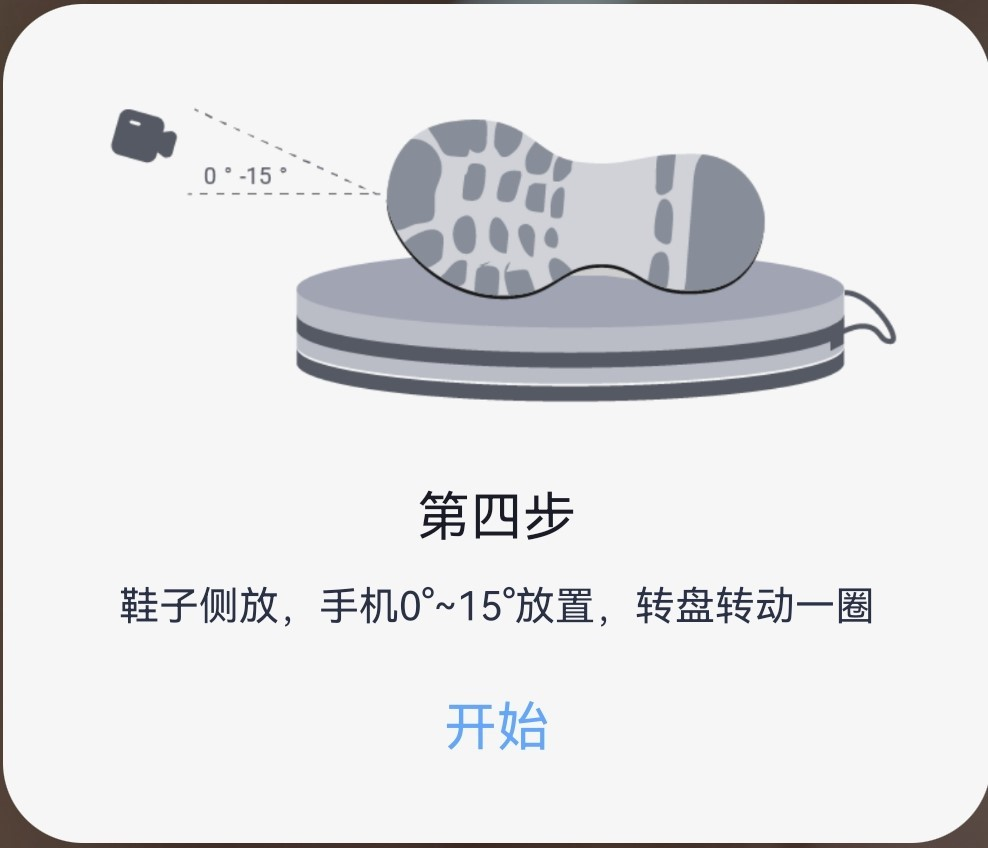
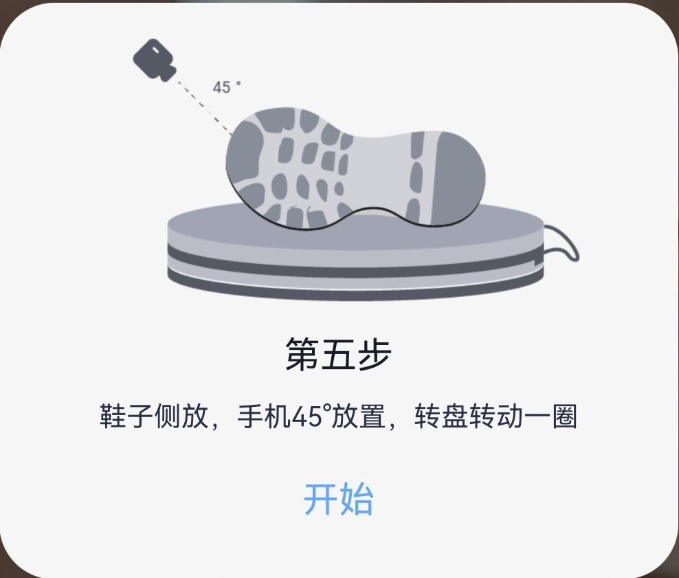
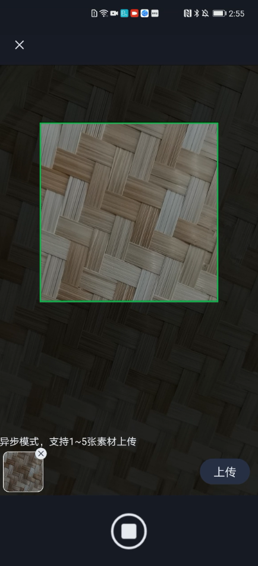
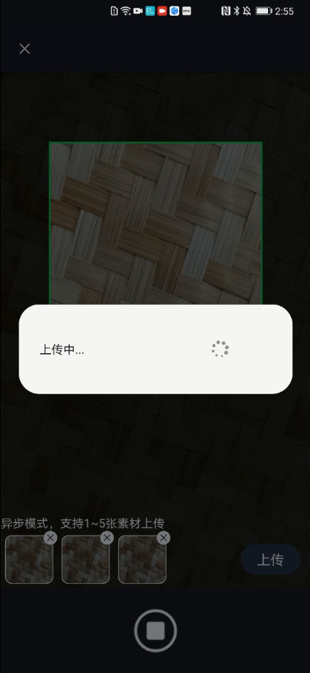

# 3DModeling-Sample

中文 | [English](https://github.com/HMS-Core/hms-3d-modeling-demo/blob/master/3DModeling-Sample/README.md)
## 目录

 * [介绍](#介绍)
 * [工程目录结构](#工程目录结构)
 * [更多场景](#更多场景)
 * [运行步骤](#运行步骤)
 * [支持的环境](#支持的环境)
 * [许可证](#许可证)

## 介绍
本示例代码目的是为了介绍3D Modeling Kit SDK的使用，其中包含以下三个能力：

### 3D物体建模
其中包括：上传采集图片、查询建模进度、下载模型。

<table><tr>
<td></td>
<td></td>
<td></td>
</tr></table>

#### 鞋子建模
**鞋子建模推荐方式**
推荐拍摄设备

- 灯箱：背景简单纯色无反光，光照明亮均匀，效果更好。
- 转盘：需要围绕物体360°拍摄，转盘可以代替人旋转。
- 手机稳定器：手机与物体拍摄距离稳定，对焦准确无模糊，效果更好。

**拍摄步骤**
转盘放置灯箱中，保证灯箱简单纯色无反光，光照明亮均匀，鞋子放置在转盘上，随着转盘转动，均匀拍摄图片，如下所示需要拍摄5圈，共108张照片。
1. 手机0°放置，转盘转动一圈拍摄24张。

<td></td>

2. 手机45°放置，转盘转动一圈拍摄24张。

<td></td>

3. 手机90°放置，相机拍向鞋窝，转盘转动半圈拍摄12张。

<td></td>

4. 鞋子侧放，手机0°~15°，转盘转动一圈拍摄24张。

<td></td>

5. 鞋子侧放，手机45°放置，转盘转动一圈拍摄24张。俯视45°拍摄时，保证图片可以同时看到鞋面和外鞋底。

<td></td>

### PBR材质生成
其中包括：上传采集图片，查询材质生成进度、下载材质。

<table><tr>
<td></td>
<td></td>
<td></td>
</tr></table>

### 动作捕捉

其中包括：实时视频流检测、视频检测、单张图片检测

<table><tr>
<td></td>
<td></td>
<td></td>
</tr></table>

详细介绍请参考[华为3D建模服务SDK](https://developer.huawei.com/consumer/cn/doc/development/graphics-Guides/introduction-0000001143077297)。

## 工程目录结构
app

    |-- com.huawei.hms.modeling3d
        |-- ui
            |-- modelingui
            	|-- ScanActivity // 3D建模采集上传
            	|-- CaptureMaterialActivity // 材质生成采集上传
            	|-- HistoryModelDataFragment // 3D建模下载
            	|-- HistoryMaterialDataFragment // 材质生成下载
        |-- utils
        	|-- skeleton
        		|-- LocalSkeletonProcessor // 动作捕捉引擎
    	|-- Modeling3dDemo

## 更多场景
华为3D建模服务（HMS 3D Modeling Kit） 提供3D建模套件，为开发者应用3D建模能力开发各类应用提供优质体验。
更多应用场景，可参考：[华为3D建模服务集成案例](https://developer.huawei.com/consumer/cn/doc/development/graphics-Guides/case-one-0000001148975606)。

## 运行步骤
 - 将本代码库克隆到本地。

       git clone https://github.com/HMS-Core/hms-3d-modeling-demo.git

 - 如果您还没有注册成为开发者，请在[AppGalleryConnect上注册并创建应用](https://developer.huawei.com/consumer/cn/service/josp/agc/index.html)。

 - agconnect-services.json文件请从[华为开发者社区](https://developer.huawei.com/consumer/cn/doc/development/graphics-Guides/config-agc-0000001142925473 )网站申请获取。

 - 替换工程中的sample-agconnect-services.json文件。

 - 编译并且在安卓设备或模拟器上运行。

注意：

该项目中的package name不能用于申请agconnect-services.json，您可以使用自定义package name来申请agconnect-services.json。
您只需将应用级build.gradle中的applicationId修改为与所申请的agconnect-services.json相同的package name，即可体验3D Modeling Kit云侧服务。

## 支持的环境
推荐使用Android 5.0及以上版本的设备。
动作捕捉能力要求ARM64位芯片手机

##  许可证
此示例代码已获得[Apache 2.0 license](https://www.apache.org/licenses/LICENSE-2.0)。
